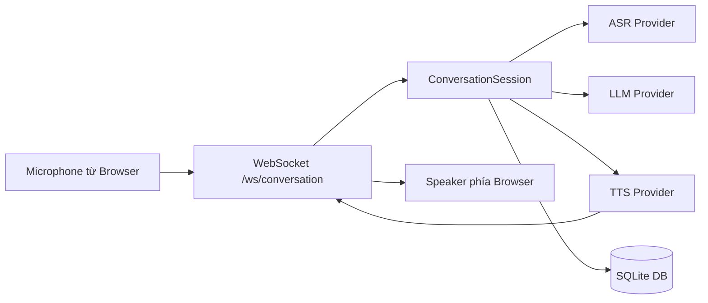
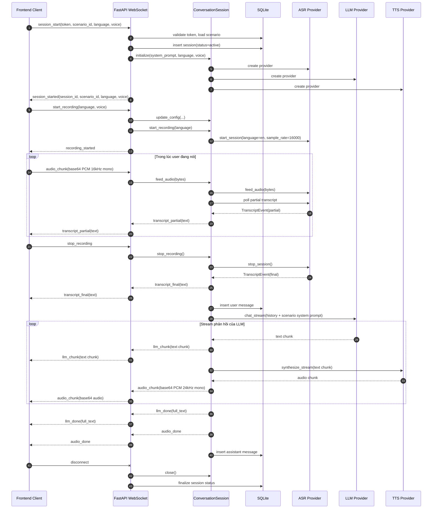

# Phân Tích Hiện Trạng Chức Năng Luyện Nói

## Phạm vi

Tài liệu này mô tả chính xác cách chức năng luyện nói đang hoạt động ở `backend` theo luồng realtime hiện tại.

Các file chính liên quan:

- `backend/app/main.py`
- `backend/app/conversation.py`
- `backend/app/services/asr/*`
- `backend/app/services/llm/*`
- `backend/app/services/tts/*`
- `backend/app/routers/sessions.py`
- `backend/tests/test_realtime_websocket.py`

## Tóm tắt nhanh

Chức năng luyện nói hiện tại là một pipeline realtime qua WebSocket:

`Microphone -> WebSocket -> ASR -> LLM -> TTS -> WebSocket -> Speaker`

Về hành vi thực tế, đây chưa phải là một cuộc hội thoại giọng nói tự nhiên 2 chiều liên tục. Nó đang hoạt động theo kiểu push-to-talk, theo turn:

1. Client mở phiên luyện nói.
2. Client bắt đầu ghi âm.
3. Client stream audio PCM lên backend.
4. Client dừng ghi âm.
5. Backend chốt transcript cuối từ ASR.
6. Backend gửi transcript cuối về frontend.
7. Backend gọi LLM để sinh câu trả lời.
8. Backend stream text trả lời và audio TTS về frontend.
9. Backend lưu tin nhắn user và assistant vào database.

Điểm rất quan trọng:

- Backend đã có sẵn bảng và schema cho `corrections`, `message_scores`, `session_scores`.
- Nhưng luồng luyện nói hiện tại chưa tạo và chưa lưu bất kỳ dữ liệu nào cho các phần này.

## Cấu hình runtime hiện tại

Từ `backend/.env`, cấu hình local hiện tại đang là:

- ASR provider: `dashscope`
- LLM provider: `gemini`
- TTS provider: `dashscope`
- Ngôn ngữ mặc định ASR: `en`
- Voice mặc định TTS: `Cherry`

Model mặc định từ code:

- ASR model: `qwen3-asr-flash-realtime`
- LLM model: `gemini-2.5-flash`
- TTS model: `qwen3-tts-flash-realtime`

Lưu ý:

- Phần này phản ánh cấu hình local hiện tại và default trong code.
- Không lặp lại API key trong tài liệu này.

## Kiến trúc tổng quát



## Sequence diagram toàn bộ luồng



## Giao thức WebSocket thực tế trong code

Endpoint:

- `ws://<host>:8000/ws/conversation`

### Client -> Server

#### 1. `session_start`

Ví dụ:

```json
{
  "type": "session_start",
  "token": "<jwt>",
  "scenario_id": 1,
  "language": "en",
  "voice": "Cherry"
}
```

Hành vi:

- Bắt buộc phải gửi đầu tiên.
- Validate JWT.
- Kiểm tra `scenario_id` có tồn tại và đang active.
- Tạo bản ghi `sessions` với trạng thái `active`.
- Khởi tạo `ConversationSession`.

#### 2. `config`

Ví dụ:

```json
{
  "type": "config",
  "language": "en",
  "voice": "Cherry"
}
```

Hành vi:

- Cập nhật `language` và `voice` cho các turn tiếp theo.
- Không tự gọi ASR, LLM hay TTS.

#### 3. `start_recording`

Ví dụ:

```json
{
  "type": "start_recording",
  "language": "en",
  "voice": "Cherry"
}
```

Hành vi:

- Áp dụng `language` và `voice`.
- Bắt đầu ASR session.
- Bắt đầu vòng poll transcript.

#### 4. `audio_chunk`

Ví dụ:

```json
{
  "type": "audio_chunk",
  "data": "<base64 PCM 16kHz 16-bit mono>"
}
```

Hành vi:

- Decode base64 thành bytes.
- Đẩy vào ASR.
- Chỉ có hiệu lực nếu đang ở trạng thái recording.

#### 5. `stop_recording`

Ví dụ:

```json
{
  "type": "stop_recording"
}
```

Hành vi:

- Dừng ASR session.
- Lấy transcript cuối.
- Kích hoạt toàn bộ pipeline phản hồi: `LLM -> TTS`.

### Server -> Client

#### 1. `session_started`

Ví dụ:

```json
{
  "type": "session_started",
  "session_id": 123,
  "scenario_id": 1,
  "language": "en",
  "voice": "Cherry"
}
```

#### 2. `config_updated`

Ví dụ:

```json
{
  "type": "config_updated",
  "language": "en",
  "voice": "Cherry"
}
```

#### 3. `recording_started`

Ví dụ:

```json
{
  "type": "recording_started"
}
```

#### 4. `transcript_partial`

Ví dụ:

```json
{
  "type": "transcript_partial",
  "text": "hello I would like"
}
```

#### 5. `transcript_final`

Ví dụ:

```json
{
  "type": "transcript_final",
  "text": "Hello, I would like a latte."
}
```

#### 6. `llm_chunk`

Ví dụ:

```json
{
  "type": "llm_chunk",
  "text": "Sure, "
}
```

#### 7. `llm_done`

Ví dụ:

```json
{
  "type": "llm_done",
  "text": "Sure, what size would you like?"
}
```

#### 8. `audio_chunk`

Ví dụ:

```json
{
  "type": "audio_chunk",
  "data": "<base64 PCM 24kHz mono 16-bit>"
}
```

#### 9. `audio_done`

Ví dụ:

```json
{
  "type": "audio_done"
}
```

#### 10. `error`

Ví dụ:

```json
{
  "type": "error",
  "message": "Invalid token"
}
```

## Những gì backend đang làm bên trong

## 1. Khởi tạo phiên WebSocket

Được xử lý trong `backend/app/main.py`.

Khi nhận `session_start`:

- Socket đã được `accept`.
- JWT được resolve sang user.
- `scenario_id` phải tồn tại và đang `is_active`.
- Tạo một bản ghi `Session` trong DB.
- Khởi tạo `ConversationSession`.
- Truyền `scenario.ai_system_prompt` vào session làm system prompt cho AI.

Ý nghĩa:

- Tính cách và bối cảnh AI hiện tại phụ thuộc vào scenario.
- Không chỉ dùng global prompt mặc định.

## 2. Vai trò của `ConversationSession`

Được xử lý trong `backend/app/conversation.py`.

`ConversationSession` là lớp orchestration trung tâm. Nó giữ:

- một instance ASR
- một instance LLM
- một instance TTS
- lịch sử hội thoại trong RAM
- các callback để bắn event ngược ra WebSocket

Điểm quan trọng:

- History hội thoại chỉ nằm trong RAM của WebSocket hiện tại.
- Không có cơ chế load lại history từ DB khi reconnect hoặc mở socket mới.

Nghĩa là:

- context nhiều turn chỉ hoạt động trong cùng một kết nối WebSocket
- không có memory xuyên phiên

## 3. Pha ghi âm

Khi nhận `start_recording`:

- `language` và `voice` được cập nhật
- ASR session được mở
- một task poll transcript chạy mỗi `0.1s`

Task poll này liên tục hỏi ASR xem có transcript mới không:

- partial transcript được gửi về frontend dưới dạng `transcript_partial`
- final transcript chỉ chắc chắn được lấy khi `stop_recording`

Điểm quan trọng:

- Backend không tự động quyết định hết lượt nói.
- Frontend phải chủ động gửi `stop_recording`.

Vì vậy luồng hiện tại là turn-taking do client điều khiển, chưa phải server-side VAD turn-taking.

## 4. Pha ASR

### Provider đang dùng theo local config: DashScope ASR

Được cài trong `backend/app/services/asr/dashscope_asr.py`.

Hành vi hiện tại:

- mở WebSocket realtime tới DashScope
- cấu hình transcription gồm:
  - language
  - sample rate `16000`
  - input format `pcm`
- nhận event từ provider
- map chúng sang `TranscriptEvent` nội bộ

Mapping hiện tại:

- partial text:
  - event provider `conversation.item.input_audio_transcription.text`
  - map thành `TranscriptType.PARTIAL`
- final text:
  - event provider `conversation.item.input_audio_transcription.completed`
  - map thành `TranscriptType.FINAL`

Định dạng audio đầu vào mong đợi:

- raw PCM
- mono
- 16-bit
- 16kHz

### Provider thay thế local: faster-whisper

Được cài trong `backend/app/services/asr/faster_whisper_asr.py`.

Nếu bật provider này:

- audio sẽ được buffer trong memory
- partial transcript chỉ xuất hiện khi đã đủ lượng audio
- final transcript được tạo khi stop session

Provider này không realtime theo kiểu stream mạnh như DashScope. Nó thiên về buffered local transcription hơn.

## 5. Pha LLM

### Provider đang dùng theo local config: Gemini qua OpenAI-compatible client

Được cài trong `backend/app/services/llm/gemini_llm.py`.

Khi có transcript cuối của user:

- user text được append vào history trong RAM
- user message được lưu vào DB
- LLM được gọi với:
  - scenario system prompt nếu có
  - nếu không thì dùng global default prompt
  - toàn bộ history của socket hiện tại

Thông số generate hiện tại:

- `temperature = 0.7`
- `max_tokens = 512`

Hành vi stream:

- text trả lời được phát ra từng phần dưới dạng `llm_chunk`
- cuối cùng backend gửi `llm_done` với full response

Điểm quan trọng:

- assistant chỉ trả lời sau khi user đã `stop_recording`
- không có simultaneous listening/speaking
- về mặt hành vi đây là half-duplex

## 6. Pha TTS

### Provider đang dùng theo local config: DashScope realtime TTS

Được cài trong `backend/app/services/tts/dashscope_tts.py`.

Hành vi hiện tại:

- mở WebSocket realtime tới DashScope TTS
- cấu hình:
  - voice đang chọn
  - output PCM `24000Hz mono 16-bit`
  - chế độ `server_commit`
- đẩy stream text từ LLM sang TTS
- nhận audio chunk và gửi ngược về frontend

Điểm quan trọng:

- Backend không đợi LLM trả hết toàn bộ text rồi mới nói.
- Nó bắt đầu TTS ngay khi text chunk đầu tiên xuất hiện.

Điều này giúp giảm độ trễ phản hồi.

### Provider thay thế local: Kokoro

Được cài trong `backend/app/services/tts/kokoro_tts.py`.

Nếu bật provider này:

- text stream sẽ được gom theo câu
- TTS chạy theo từng câu
- output vẫn là PCM 16-bit ở 24kHz

## 7. Persistence hiện tại

### Những gì đang được lưu thật

Luồng luyện nói hiện tại chủ động ghi vào:

- `sessions`
- `messages`

Cụ thể:

- khi `session_start`:
  - tạo 1 dòng trong `sessions`
- khi có final transcript hợp lệ:
  - tạo 1 dòng `messages` với `role = "user"`
- khi assistant trả lời xong:
  - tạo 1 dòng `messages` với `role = "assistant"`

Thứ tự:

- `order_index` bắt đầu từ `1`
- tăng dần theo thứ tự message được lưu

### Trạng thái cuối của session

Khi WebSocket đóng:

- nếu đã có ít nhất 1 user turn finalized:
  - `status = "completed"`
  - `duration_seconds` được tính
- nếu chưa có turn user nào finalized:
  - `status = "abandoned"`
  - `duration_seconds = null`

Quy tắc này khá rõ:

- completed nghĩa là phiên có ít nhất 1 lượt nói hoàn chỉnh
- abandoned nghĩa là phiên được mở nhưng chưa có utterance cuối nào được lưu

## Những phần đã có model/schema nhưng chưa hoạt động trong luồng luyện nói

Codebase đã có model và response schema cho:

- `corrections`
- `message_scores`
- `session_scores`

Nhưng realtime speaking pipeline hiện tại chưa:

- chấm pronunciation
- chấm fluency
- chấm grammar
- chấm vocabulary
- chấm intonation
- sinh danh sách từ phát âm sai
- sinh feedback theo từng câu nói
- sinh feedback tổng hợp theo phiên
- sinh grammar correction hoặc naturalness correction
- lưu file audio của user hoặc assistant

Nghĩa là tính năng hiện tại mới làm được:

- speech-to-text
- AI trả lời hội thoại
- text-to-speech
- lưu lịch sử hội thoại

Chứ chưa làm được:

- chấm luyện nói
- phân tích phát âm
- corrective feedback có cấu trúc

## Ảnh chụp trạng thái database local hiện tại

Tại thời điểm phân tích file `backend/ai_talk_practice.db`:

- có đủ các bảng:
  - `users`
  - `scenarios`
  - `sessions`
  - `messages`
  - `corrections`
  - `message_scores`
  - `session_scores`
- số scenario hiện có: `6`
- số dòng `message_scores`: `0`
- số dòng `session_scores`: `0`
- số dòng `corrections`: `0`

Kết luận quan sát được:

- Phần scoring/correction hiện chưa được gắn vào luồng luyện nói đang chạy.

Ngoài ra, local DB hiện có một số `sessions` cũ vẫn ở trạng thái `active` và chưa có `messages`.

Suy luận:

- Theo code hiện tại, khi socket đóng thì session mới đáng ra phải chuyển sang `completed` hoặc `abandoned`.
- Vì vậy các dòng `active` cũ nhiều khả năng đến từ logic cũ, trường hợp terminate bất thường, hoặc dữ liệu được tạo ngoài close path hiện tại.
- Đây là suy luận dựa trên dữ liệu và code hiện tại, không phải kết luận được chứng minh trực tiếp từ một dòng code duy nhất.

## Hệ thống scenario hiện tại

Backend hiện đang seed sẵn 6 scenario:

1. Ordering Coffee at a Cafe
2. Job Interview - Tell Me About Yourself
3. Checking In at a Hotel
4. Visiting the Doctor
5. Debating Climate Change Solutions
6. Shopping for Clothes

Mỗi scenario có:

- title
- description
- learning objectives
- `ai_system_prompt`
- category
- difficulty

Điều này rất quan trọng vì trải nghiệm luyện nói hiện tại phụ thuộc mạnh vào `scenario.ai_system_prompt`.

Ví dụ:

- scenario cafe khiến AI đóng vai barista
- scenario interview khiến AI đóng vai interviewer

Vì vậy speaking feature hiện tại không chỉ là generic English tutor. Nó là một dạng roleplay tutor theo ngữ cảnh scenario.

## REST API liên quan tới speaking

Phần realtime speaking chạy bằng WebSocket, nhưng sau phiên luyện nói có REST API để xem lịch sử:

- `GET /api/sessions`
- `GET /api/sessions/{session_id}`

Các API này trả về:

- metadata của session
- danh sách messages
- score nếu có
- corrections nếu có

Thực tế hiện tại:

- messages có thể có dữ liệu
- score và correction về mặt schema đã hỗ trợ
- nhưng hiện đang rỗng vì speaking pipeline chưa populate

## Các đặc điểm hành vi quan trọng của hệ thống hiện tại

## 1. Đây là turn-based, chưa phải always-on

Hành vi hiện tại gần với:

- bấm nói
- dừng
- chờ AI trả lời

Chưa phải:

- full-duplex voice chat
- open-mic liên tục với auto turn detection

## 2. Final transcript là cổng quyết định toàn bộ luồng sau đó

Nếu backend không lấy được final transcript hợp lệ khi `stop_recording`, thì:

- không lưu user message
- không gọi LLM
- không gọi TTS

Đây là một điểm điều khiển rất quan trọng trong implementation hiện tại.

## 3. Partial transcript chỉ phục vụ UI

`transcript_partial` được gửi về frontend, nhưng:

- không được lưu DB
- không được gửi vào LLM
- không ảnh hưởng tới conversation state cuối

Chỉ final transcript mới có giá trị thật với hội thoại.

## 4. Database hiện chỉ là nơi lưu history, chưa phải live memory

Logic hội thoại realtime không đọc lại message cũ từ DB để tạo context cho socket mới.

Cho nên DB hiện tại đóng vai trò:

- archive
- nguồn lịch sử sau phiên

Chứ chưa phải:

- lớp memory để phục hồi hoặc nối tiếp hội thoại

## 5. Audio transport đang là JSON base64

Hiện tại payload audio đi qua WebSocket bằng JSON text frame chứa base64.

Ưu điểm:

- đơn giản
- dễ debug

Nhược điểm:

- payload to hơn raw binary
- có overhead encode/decode

Nó hoạt động được, nhưng chưa phải lựa chọn hiệu quả nhất về băng thông.

## Những điểm lệch giữa README và code thực tế

Hiện có vài chỗ tài liệu và code chưa khớp nhau:

### 1. Event mở phiên chưa khớp

README nói server trả:

- `ready`

Code thực tế trả:

- `session_started`

### 2. `session_start` là bắt buộc nhưng tài liệu chưa phản ánh rõ

Code hiện tại bắt buộc phải gửi:

- `session_start`

trước tất cả event khác.

README hiện mô tả nhiều hơn về `start_recording`, `audio_chunk`, `stop_recording`, `config`, nên chưa phản ánh đủ handshake thật.

### 3. Mô tả tính năng rộng hơn khả năng thực tế

Schema và model cho thấy định hướng có scoring và corrections, nhưng realtime flow đang chạy thật chỉ bao gồm:

- ASR
- hội thoại LLM
- TTS
- lưu lịch sử

## Còn thiếu gì nếu mục tiêu là một speaking practice hoàn chỉnh

Nếu mục tiêu sản phẩm là một hệ thống luyện nói hoàn chỉnh, backend hiện còn thiếu các lớp chức năng sau:

### A. Pronunciation assessment

Đang thiếu:

- forced alignment hoặc so sánh ở mức phoneme
- chấm phát âm theo từ
- tách từ phát âm sai

### B. Fluency analysis

Đang thiếu:

- phân tích pause
- phân tích tốc độ nói
- filler-word analysis
- hesitation analysis

### C. Grammar và naturalness correction

Đang thiếu:

- pipeline sửa câu của user
- explanation cho lỗi
- taxonomy lỗi có cấu trúc

### D. Tổng hợp session và theo dõi tiến bộ

Đang thiếu:

- gộp điểm từ nhiều turn
- feedback summary cho session
- tracking tiến bộ theo thời gian

### E. Tương tác giọng nói tự nhiên hơn

Đang thiếu:

- server-driven turn detection
- interruption handling
- barge-in support
- trạng thái nghe và nói đan xen

### F. Lưu audio hoặc replay

Đang thiếu:

- lưu recording của user
- lưu audio của AI
- trả về audio URL ổn định

## Ý nghĩa thực tế của tính năng hiện tại

Backend hiện tại đã đủ để chạy một phiên luyện nói version đầu tiên, nhưng theo nghĩa hẹp:

- user nói
- backend chuyển speech thành text
- AI trả lời theo vai của scenario
- backend nói lại bằng TTS
- lịch sử hội thoại được lưu lại

Vì vậy hiện tại mô tả chính xác nhất là:

- một hệ thống hội thoại giọng nói theo scenario

Chưa nên mô tả là:

- một hệ thống chấm luyện nói đầy đủ
- một speaking assessment engine

## Cách gọi tên phù hợp với trạng thái hiện tại

Nếu muốn cách gọi bám sát code hiện tại, tên phù hợp nhất là:

- realtime scenario conversation
- AI roleplay speaking practice
- voice conversation practice

Những cách gọi chưa thật chính xác với implementation hiện tại:

- pronunciation scoring engine
- speaking evaluation system
- full speaking coach

## Tham chiếu code

Luồng WebSocket chính:

- `backend/app/main.py`

Lớp orchestration:

- `backend/app/conversation.py`

ASR providers:

- `backend/app/services/asr/dashscope_asr.py`
- `backend/app/services/asr/faster_whisper_asr.py`

LLM providers:

- `backend/app/services/llm/gemini_llm.py`
- `backend/app/services/llm/openai_llm.py`

TTS providers:

- `backend/app/services/tts/dashscope_tts.py`
- `backend/app/services/tts/kokoro_tts.py`

API xem lịch sử session:

- `backend/app/routers/sessions.py`

Scenario seed:

- `backend/app/seed.py`

Test realtime websocket:

- `backend/tests/test_realtime_websocket.py`

## Kết luận cuối

Chức năng luyện nói hiện tại đang hoạt động như một pipeline hội thoại giọng nói realtime theo scenario, có lưu lịch sử hội thoại.

Những gì đang chạy được:

- mở phiên có xác thực
- inject vai trò AI theo scenario
- upload audio qua websocket
- speech-to-text
- partial transcript và final transcript
- stream phản hồi text từ LLM
- stream phản hồi audio từ TTS
- lưu message user và assistant
- đóng session với trạng thái `completed` hoặc `abandoned`

Những gì chưa được triển khai trong live speaking flow:

- pronunciation scoring
- fluency scoring
- grammar scoring
- vocabulary scoring
- intonation scoring
- corrections có cấu trúc
- tổng hợp điểm cho session
- lưu audio để replay
- memory xuyên phiên
- tự động turn-taking

Đây là sự khác biệt quan trọng nhất giữa "backend đang có" và "một speaking practice platform hoàn chỉnh".
